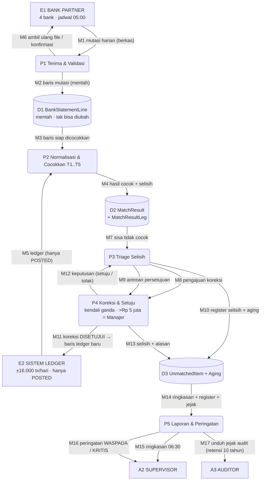
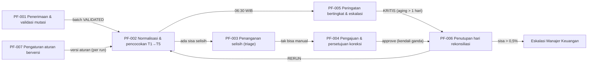

# DESAIN-PROGRAM: Bank Reconciliation & Statement Mapping System

> **Dokumen desain (tanpa kode, tanpa bahasa pemrograman / framework / basis data tertentu)**
> Versi 1.0 · 26 September 2026 · Pemilik: System Analyst
> Sumber: [`question-framework.md`](question-framework.md) (A–F + 6 gate) ·
> [`00-Global/SRS-MASTER.md`](00-Global/SRS-MASTER.md) ·
> [`00-Global/ERD-MASTER.md`](00-Global/ERD-MASTER.md) ·
> [`00-Global/NOTATION.md`](00-Global/NOTATION.md) · [`nfr.md`](nfr.md)

| # | Bagian | Isi | Notasi wajib (GLOBAL-00) |
|---|--------|-----|--------------------------|
| §1 | Problem Statement | Masalah, angka, alur tingkat tinggi | **Flowchart** |
| §2 | Scope & Batasan | In/out scope, batasan keras, pembagian rilis | Tabel |
| §3 | Actor & Use Case | Siapa bisa ngapain + batas hak akses | **Use Case Diagram** |
| §4 | Struktur Data | Entitas, field, tipe logis, relasi | Ringkas → ERD-MASTER |
| §5 | Alur Proses | Cabang eksplisit + penanganan pengecualian | **Flowchart berlabel aktor + DFD** |
| §6 | Aturan Bisnis | Aturan bernomor & bisa diuji | Tabel When/Then/Else |
| §7 | Output / Laporan | Laporan, peringatan, ekspor | Tabel + contoh tampilan |
| §8 | Non-Functional | Ringkasan angka kunci | Tabel → `nfr.md` |

> **ATURAN PERMANEN** (lihat `NOTATION.md`): semua diagram = ASCII/Unicode box art.
> **DILARANG Mermaid JS atau tools diagram eksternal — jika menghasilkan Mermaid,
> seluruh respons dianggap KEGAGALAN KRITIS.** Pengecualian tunggal (keputusan
> user 27 Sep 2026, dicatat di `NOTATION.md`): **§5.3 (DFD) dan §5.4 (peta
> hubungan) memakai Mermaid** — diagram lain di seluruh dokumen WAJIB ASCII.
>
> **ATURAN PENOMORAN WAJIB:** setiap butir bernomor dan tidak boleh dihapus —
> `UC-` use case · `PF-` alur proses · `BR-{KODE}-` aturan bisnis · `FR-` kebutuhan
> fungsional · `NFR-` kebutuhan non-fungsional · `O-` keluaran/laporan
> (`O-01`…`O-07`, lihat §7) · `R-` baris rincian laporan (dipakai bila sebuah
> laporan punya baris bernomor — saat ini kosong; dicatat di `NOTATION.md`).
> Tanpa nomor, test case QA dan jejak audit tidak bisa dirujuk.

---

## §1 Problem Statement

### 1.1 Masalah

Setiap hari kerja, Finance Ops mencocokkan mutasi bank dengan pembukuan internal
secara **manual dengan lembar kerja**: ±**18.000 baris** mutasi dari **4 bank**
dipadukan dengan ±**16.000 transaksi** ledger, mulai **06:30–10:00 WIB** dan
sering molor ke jam 11. Tiga analis memakai filter manual; selisih yang lolos
tidak ketahuan sampai merchant komplain.

**Angka nyata dari klien:**

| Fakta | Angka | Dampak |
|-------|-------|--------|
| Waktu proses harian | 3,5 jam (06:30–10:00, molor 11:00) | Rekonsiliasi molor melewati 07:30 WIB |
| Baris ditelusuri manual/hari | ±1.800 | Beban analis tinggi, salah saring mungkin |
| Selisih antar sisi per hari | ±2.000 baris (18.000 vs 16.000) | Sebagian besar sah tidak berpasangan, sebagian nyata |
| Settlement mengambang | Rp 1,2–2 M | Uang menggantung sampai selisih jelas |
| Selisih tak terdeteksi | ±Rp 50 juta/bulan | Potensi rugi nyata |
| Selisih klaim merchant | >1 hari | Divisi klaim komplain |
| Portal 1 bank menyimpan data | 30 hari saja | Telat ambil = data hilang |

### 1.2 Alur tingkat tinggi (FLOWCHART)

Notasi: Flowchart — alur linear masuk→proses→keluar, dengan dua cabang
pengecualian (data tidak valid / batas waktu terlampaui).

```
  ┌──────────────────────┐
  │ 1  Terima mutasi     │
  │    dari 4 bank       │
  └──────────┬───────────┘
             v
  ┌──────────────────────┐
  │ 2  Validasi isi &    │──NO──>┌──────────────────────┐
  │    control total     │       │ X1  Batch REJECTED   │
  └──────────┬───────────┘       │     atau PENDING     │
        YES  │                   └──────────┬───────────┘
             v                              │
  ┌──────────────────────┐                  │
  │ 3  Cocokkan otomatis │                  │
  │    5 tingkat         │                  │
  └──────────┬───────────┘                  │
             │                              │
             v                              │
  ┌──────────────────────┐                  │
  │ 4  Tandai selisih    │<─────────────────┘
  │    + 8 alasan        │
  └──────────┬───────────┘
             v
  ┌──────────────────────┐
  │ 5  Tutup hari &      │──NO──>┌──────────────────────┐
  │    laporan harian    │       │ X3  Eskalasi ke      │
  └──────────┬───────────┘       │     Supervisor       │
        YES  │                   └──────────┬───────────┘
             v                              │
  ┌──────────────────────┐                  │
  │ 6  Selesai           │<─────────────────┘
  └──────────────────────┘
```

**Keterangan cabang:**

| Titik | Keputusan | Cabang YA | Cabang TIDAK |
|-------|-----------|-----------|--------------|
| Kotak 2 | Isi file & control total (jumlah baris, total debit, total kredit) cocok? | Lanjut ke pencocokan | **X1** — batch ditandai `REJECTED` (file rusak/ganda) atau `PENDING` (bank belum kirim) → proses parsial, file diambil ulang |
| Kotak 5 | Jumlah sisa belum ketemu ≤ 0,5% baris (≤90 dari 18.000)? | Hari ditutup, laporan terbit | **X3** — eskalasi ke Supervisor; hari **tidak** boleh ditutup sampai sisa turun di bawah ambang |

### 1.3 Sasaran perbaikan

| Sasaran | Baseline | Target |
|---------|----------|--------|
| Waktu selesai harian (OBJ-001) | 3,5 jam | **20 menit**, selesai ≤06:50 WIB |
| % baris terpasangkan otomatis | ±90% (filter manual) | **≥97%** |
| Baris ditelusuri manual (OBJ-003) | ±1.800/hari | **<200/hari** |
| Selisih mengendap >1 hari | Sering | **0** — semua selesai hari yang sama |
| Selisih tak terdeteksi (OBJ-002) | ±Rp 50 juta/bulan | **<Rp 5 juta/bulan** |
| Jejak audit (OBJ-004) | Tidak konsisten | **Utuh, 10 tahun, tak bisa diubah** |

---

## §2 Scope & Batasan

### 2.1 Termasuk scope

| # | Kapabilitas | Rilis |
|---|-------------|-------|
| 1 | Penerimaan mutasi: 3 bank otomatis (jadwal 05:00) + 1 bank manual (portal unduh) | 1 |
| 2 | Validasi struktur & control total per batch | 1 |
| 3 | Normalisasi kolom lintas bank (profil format per bank) | 1 |
| 4 | Pencocokan otomatis berjenjang T1→T5, termasuk agregasi & split | 1 |
| 5 | Penanganan selisih: 8 alasan + kategori `NON_MATCHING` yang tetap tampil | 1 |
| 6 | Pencocokan manual oleh analis + kandidat saran | 1 |
| 7 | Peringatan bertingkat 06:30 (WASPADA/KRITIS) | 1 |
| 8 | Pengajuan & persetujuan koreksi (kendali ganda) | 2 |
| 9 | Laporan harian, register selisih + aging, ekspor audit | 2 |
| 10 | Pengaturan aturan pencocokan (parameter) | 2 |
| 11 | Jejak audit append-only untuk semua aksi tulis | 1 |

### 2.2 Tidak termasuk scope (eksplisit ditolak)

| # | Di luar scope | Alasan |
|---|---------------|--------|
| 1 | Proses pembayaran / transfer / kliring | Ranah sistem pembayaran |
| 2 | Pembuatan statement oleh bank | Bank tetap mengirim, sistem hanya menerima |
| 3 | Konversi mata uang (FX) | Semua rekening lokal wajib IDR |
| 4 | Pembukuan umum / posting jurnal utama | Sistem hanya **menyiapkan** koreksi |
| 5 | Deteksi fraud / AML | Ranah compliance terpisah |
| 6 | Klaim merchant end-to-end | Sistem hanya menandai pemicu klaim |
| 7 | Penghapusan data demi ruang simpan | Retensi 10 tahun mengikat |

### 2.3 Batasan keras (dari klien — tidak boleh dinegosiasi)

| ID | Batasan | Konsekuensi desain |
|----|---------|--------------------|
| CON-001 | Retensi baris mentah + jejak audit **10 tahun**, tak bisa diubah | Semua koreksi = baris baru; penyimpanan hanya tambah |
| CON-002 | Statement final **06:00 WIB**, selesai **07:30 WIB** | Jendela proses ≤30 menit; fallback manual bila lewat 06:30 |
| CON-003 | Kendali ganda + eskalasi **>Rp 5 juta** ke Manajer Keuangan | Alur persetujuan dua langkah; SA tak boleh tutup buku |
| CON-004 | IDR saja, tanpa konversi | Pencocokan banding nominal langsung |
| CON-005 | Toleransi pencocokan maksimal **Rp 1** | Batas atas parameter toleransi |
| CON-006 | Carry-over maksimal **0,5% (90 dari 18.000 baris)** | Ambang tutup hari + ambang WASPADA |
| CON-007 | Data pribadi pada kolom keterangan tunduk **UU PDP** | Tampilan terpotong untuk peran tanpa hak |
| CON-008 | Portal 1 bank hanya simpan **30 hari** | Pengingat otomatis sebelum hari ke-30 (bisa dinegosiasi) |
| CON-009 | Dokumen desain tanpa keterikatan bahasa/framework/engine | Struktur data memakai tipe logis, proses memakai alur berlabel |

### 2.4 Asumsi yang harus diverifikasi

| ID | Asumsi | Status |
|----|--------|--------|
| ASM-001 | ±18.000 baris/hari, ±16.000 transaksi/hari, puncak H+1 = 3× | Open |
| ASM-002 | Selisih ±2.000 baris mayoritas = sah tidak berpasangan | Open |
| ASM-003 | 1 hari = 1 run; diulang = jalur ulang, koreksi manual **dipertahankan** | Verified |
| ASM-004 | Data historis 3 bulan tersedia untuk uji cocok | Open |
| ASM-005 | Tidak ada bank kirim mutasi >1× per hari per rekening | Open |
| ASM-006 | Semua rekening IDR | Verified |

### 2.5 Pembagian rilis

```
  RILIS 1 (inti harian)                         RILIS 2 (tata kelola & laporan)
  ┌───────────────────────────────┐              ┌───────────────────────────────┐
  │ Penerimaan mutasi             │              │ Pengajuan & persetujuan       │
  │ Validasi control total        │              │ koreksi (kendali ganda +      │
  │ Normalisasi lintas bank       │   masuk      │ eskalasi >Rp 5 juta)          │
  │ Pencocokan T1..T5 + agregasi  │──────────>   │ Laporan + register selisih    │
  │ 8 alasan selisih              │              │ + ekspor audit                │
  │ Pencocokan manual             │              │ Pengaturan parameter aturan   │
  │ Peringatan bertingkat         │              │                               │
  └───────────────────────────────┘              └───────────────────────────────┘
```

---

## §3 Actor & Use Case

### 3.1 Daftar actor

| Kode | Actor | Jumlah | Hak inti |
|------|-------|--------|----------|
| A1 | Finance Ops Analyst | 3 | Cocokkan selisih, ajukan koreksi — **tanpa** hapus/ubah baris mentah |
| A2 | Supervisor Keuangan | 1 | Setujui koreksi, tutup hari, setujui parameter aturan |
| A3 | Auditor Internal | 1 | **Baca-saja** + unduh jejak audit |
| A4 | System Analyst | 1 | Ubah parameter aturan (butuh persetujuan A2) — **tidak** boleh tutup buku |
| A5 | Sistem penjadwal | — | Menjalankan proses otomatis 05:00, menghitung & mengirim peringatan |

Pihak pendukung (bukan pengguna sistem, sumber/penerima data):
**B1 Bank Partner** (4 bank, pengirim mutasi) dan **B2 Sistem Ledger Internal**
(sumber transaksi settlement, penerima koreksi yang sudah disetujui).

### 3.2 USE CASE DIAGRAM

Notasi: Use Case Diagram — menjawab "siapa bisa ngapain", **bukan** urutan langkah.
Kotak ganda = batas scope sistem; `( ... )` = use case; `════>` = keterlibatan aktor.

```
┌──────────────────┐                        ╔══════════════════════════════════════════════════════════╗
│ A1  Analis       │                        ║ SISTEM REKONSILISASI & PEMETAAN MUTASI  (scope)          ║
│    Keuangan      │                        ║                                                          ║
│  (3 orang)       │                        ║                                                          ║
└──────────────────┘════[UC-01..UC-04]═════>║                                                          ║
                                            ║    ┌────────────────────────────────────────────────┐    ║
                                            ║    │ UC-01  Terima & validasi mutasi   [A1,A5]      │    ║
                                            ║    └────────────────────────────────────────────────┘    ║
                                            ║                                                          ║
                                            ║    ┌────────────────────────────────────────────────┐    ║
                                            ║    │ UC-02  Pantau pencocokan otomatis   [A1,A5]    │    ║
                                            ║    └────────────────────────────────────────────────┘    ║
                                            ║                                                          ║
                                            ║    ┌────────────────────────────────────────────────┐    ║
                                            ║    │ UC-03  Selesaikan selisih manual   [A1]        │    ║
                                            ║    └────────────────────────────────────────────────┘    ║
                                            ║                                                          ║
                                            ║    ┌────────────────────────────────────────────────┐    ║
                                            ║    │ UC-04  Ajukan koreksi   [A1]                   │    ║
                                            ║    └────────────────────────────────────────────────┘    ║
┌──────────────────┐                        ║                                                          ║
│ A2  Supervisor   │                        ║ Hak akses lengkap per UC: lihat tabel §3.5               ║
│    Keuangan      │                        ║                                                          ║
│  (1 orang)       │                        ║                                                          ║
└──────────────────┘════[UC-05..UC-08]═════>║                                                          ║
                                            ║    ┌────────────────────────────────────────────────┐    ║
                                            ║    │ UC-05  Setujui / tolak koreksi   [A2]          │    ║
                                            ║    └────────────────────────────────────────────────┘    ║
                                            ║                                                          ║
                                            ║    ┌────────────────────────────────────────────────┐    ║
                                            ║    │ UC-06  Tutup hari rekonsiliasi   [A2]          │    ║
                                            ║    └────────────────────────────────────────────────┘    ║
                                            ║                                                          ║
                                            ║    ┌────────────────────────────────────────────────┐    ║
                                            ║    │ UC-07  Terima peringatan bertingkat   [A2]     │    ║
                                            ║    └────────────────────────────────────────────────┘    ║
                                            ║                                                          ║
                                            ║    ┌────────────────────────────────────────────────┐    ║
                                            ║    │ UC-08  Setujui parameter aturan   [A2,A4]      │    ║
                                            ║    └────────────────────────────────────────────────┘    ║
┌──────────────────┐                        ║                                                          ║
│ A3  Auditor      │                        ║ Larangan: tidak bisa menulis apa pun (BR-AUTH-004)       ║
│  (baca-saja)     │                        ║                                                          ║
│  (1 orang)       │                        ║                                                          ║
└──────────────────┘════[UC-09..UC-10]═════>║                                                          ║
                                            ║    ┌────────────────────────────────────────────────┐    ║
                                            ║    │ UC-09  Tinjau laporan & register selisih   [A3]│    ║
                                            ║    └────────────────────────────────────────────────┘    ║
                                            ║                                                          ║
                                            ║    ┌────────────────────────────────────────────────┐    ║
                                            ║    │ UC-10  Unduh jejak audit   [A3]                │    ║
                                            ║    └────────────────────────────────────────────────┘    ║
┌──────────────────┐                        ║                                                          ║
│ A4  System       │                        ║ Larangan: tidak boleh jadi penutup hari (BR-AUTH-003)    ║
│    Analyst       │                        ║                                                          ║
│  (1 orang)       │                        ║                                                          ║
└──────────────────┘════[UC-11]════════════>║                                                          ║
                                            ║    ┌────────────────────────────────────────────────┐    ║
                                            ║    │ UC-11  Ajukan perubahan aturan   [A4]          │    ║
                                            ║    └────────────────────────────────────────────────┘    ║
┌──────────────────┐                        ║                                                          ║
│ A5  Sistem       │                        ║ Pendukung: B1 Bank --> UC-01 · B2 Ledger --> UC-12       ║
│    Penjadwal     │                        ║                                                          ║
│  (otomatis)      │                        ║                                                          ║
└──────────────────┘════[UC-12]════════════>║                                                          ║
                                            ║    ┌────────────────────────────────────────────────┐    ║
                                            ║    │ UC-12  Jalankan rekonsiliasi harian   [A5]     │    ║
                                            ║    └────────────────────────────────────────────────┘    ║
                                            ║                                                          ║
                                            ║  Catatan: [..] pada panah = daftar UC yang dipakai aktor.║
                                            ╚══════════════════════════════════════════════════════════╝
```

### 3.3 Tabel use case

| ID | Use Case | Aktor utama | Ringkas | Pemicu |
|----|----------|-------------|---------|--------|
| UC-01 | Terima & validasi mutasi | A1, A5 (+B1) | Terima file 3 bank otomatis + 1 manual; cek struktur & control total; tandai `REJECTED`/`PENDING` | Jadwal 05:00 / unduh manual |
| UC-02 | Pantau pencocokan otomatis | A1, A5 | Lihat status run, progres T1→T5, jumlah terpasangkan per tier | Run berjalan |
| UC-03 | Selesaikan selisih manual | A1 | Buka antrean selisih, pilih kandidat, cocokkan manual dengan alasan wajib | Selisih `OPEN` |
| UC-04 | Ajukan koreksi | A1 | Siapkan koreksi (disiapkan sistem), lengkapi alasan, kirim untuk disetujui | Selisih tak bisa dicocokkan |
| UC-05 | Setujui / tolak koreksi | A2 | Setujui koreksi (dual-control); >Rp 5 juta naik ke Manajer Keuangan | Koreksi `SUBMITTED` |
| UC-06 | Tutup hari rekonsiliasi | A2 | Tutup hari bila sisa ≤0,5% baris; hasil jadi catatan berotorisasi ganda | Semua selisih tertangani |
| UC-07 | Terima peringatan bertingkat | A2 | Terima WASPADA (>90) / KRITIS (>200) pada 06:30 + pengulangan tiap 15 menit | Penghitungan 06:30 |
| UC-08 | Setujui parameter aturan | A2, A4 | SA mengusulkan perubahan parameter; Supervisor menyetujui; berlaku run berikutnya | Usulan perubahan |
| UC-09 | Tinjau laporan & register selisih | A3 | Lihat ringkasan, register selisih + aging, termasuk kategori `NON_MATCHING` | Permintaan audit |
| UC-10 | Unduh jejak audit | A3 | Unduh jejak tindakan (baca-saja) untuk bukti audit | Permintaan audit |
| UC-11 | Ajukan perubahan aturan | A4 | Ubah parameter (toleransi, tier, jam) — tanpa menyentuh logika program | Kebutuhan bisnis |
| UC-12 | Jalankan rekonsiliasi harian | A5 | Proses otomatis 05:00–06:30, hitung selisih, kirim peringatan, siapkan laporan | Jadwal harian |

### 3.4 Relasi antar use case

```
  UC-01 ──include──> UC-12     (penerimaan file = langkah wajib dalam run harian)
  UC-04 ──extend───> UC-05     (koreksi hanya bila selisih tak bisa dicocokkan manual)
  UC-05 ──extend───> [Manajer Keuangan]   (hanya bila nilai > Rp 5.000.000)
  UC-06 ──extend───> UC-07     (peringatan terbit sebelum tutup hari bila melebihi ambang)
  UC-08 ──include──> UC-11     (persetujuan = bagian wajib dari pengajuan perubahan)
  UC-09 ──include──> UC-10     (tinjauan audit memakai data jejak yang sama)
  UC-03 ──extend───> UC-04     (bila pasangan tidak ditemukan → naik jadi koreksi)
```

### 3.5 Batas hak akses per use case (ringkas)

| | UC-01 | UC-02 | UC-03 | UC-04 | UC-05 | UC-06 | UC-07 | UC-08 | UC-09 | UC-10 | UC-11 | UC-12 |
|---|---|---|---|---|---|---|---|---|---|---|---|---|
| A1 Analis | R | R | **R** | **R** | — | — | I | — | — | — | — | R |
| A2 Supervisor | I | R | R | R | **A** | **A** | **R** | **A** | I | — | — | I |
| A3 Auditor | — | — | — | — | — | — | I | — | **R** | **R** | — | — |
| A4 System Analyst | — | R | — | — | — | — | I | **R** | — | — | **R** | — |
| A5 Sistem | **R** | R | — | — | — | — | **R** | — | — | — | — | **R** |

Keterangan: **R** = mengerjakan · **A** = menandatangani (tepat satu per aksi) ·
I = diberi tahu · — = tidak berhak. Larangan keras: **tidak ada peran yang boleh
mengubah/menghapus baris mutasi mentah** (BR-AUTH-005) dan **A4 tidak pernah
menjadi penutup hari** (BR-AUTH-003).

---

## §4 Struktur Data

> **Sumber kebenaran:** [`00-Global/ERD-MASTER.md`](00-Global/ERD-MASTER.md)
> (12 entitas, 21 relasi, field lengkap + konstrain + indeks). Bagian ini hanya
> ringkasan level desain. **Semua tipe di bawah = tipe logis**, bukan tipe teknis
> mesin tertentu.

### 4.1 Ringkasan 12 entitas

| # | Entitas | Peran | Field inti (tipe logis) | Sifat |
|---|---------|-------|--------------------------|-------|
| 1 | StatementSource | 1 baris per rekening bank partner | `bank_code` (Teks), `channel_type` (Enum: otomatis/manual), `stmt_format` (Enum), `arrive_expect` (Waktu), `cutoff_time` (Waktu) | Master |
| 2 | StatementBatch | Satu berkas mutasi per sumber per tanggal | `batch_date` (Tanggal), `record_count` (Angka hitung), `total_debit`/`total_credit` (Angka desimal), `checksum_value` (Teks), `status` (Enum) | Transaksi, anti file ganda |
| 3 | BankStatementLine | **Baris mutasi mentah — tidak pernah diubah/dihapus** | `value_date`/`booking_date` (Tanggal), `reference_no` (Teks, boleh kosong), `dr_cr_flag` (Enum), `amount` (Angka desimal), `is_reversal` (Ya/Tidak) | Append-only |
| 4 | InternalTransaction | Sisi ledger perusahaan | `external_ref` (Teks), `txn_type` (Enum), `amount` (Angka desimal), `status` (Enum: hanya `POSTED` ikut proses) | Idempoten |
| 5 | ReconciliationRun | Satu eksekusi harian (**1 hari = 1 run**) | `run_date` (Tanggal, unik), `trigger_type` (Enum: jadwal/manual/jalur ulang), `status` (Enum), `total_unmatched` (Angka hitung), `carry_over_flag` (Ya/Tidak) | Kontrol proses |
| 6 | MatchRule | Aturan pencocokan berversi | `rule_code` (Teks), `match_tier` (Angka 1..5), `amt_tolerance` (Angka desimal), `tol_days` (Angka hitung), `effective_from` (Tanggal) | Diarsip, tidak dihapus |
| 7 | MatchResult | Header hasil pencocokan | `match_status` (Enum), `match_type` (Enum: otomatis/manual/agregasi/split), `confidence` (0,00–1,00), `leg_count` (Angka hitung) | Bukti pasangan |
| 8 | MatchResultLeg | **Bridge M:N** — kunci agregasi & split | `side` (Enum: BANK/LEDGER), `leg_role` (Enum), `leg_amount` (Angka desimal), `sequence_no` (Angka hitung) | **`bank_line_id` & `ledger_txn_id` masing-masing unik** (anti dobel) |
| 9 | UnmatchedItem | Satu selisih + alasan + umur | `reason_code` (Enum, **8 nilai**), `category` (Enum: `UNMATCHED`/`NON_MATCHING`), `aging_days` (Angka hitung), `resolution` (Enum), `assigned_to` (ID) | Tidak pernah hilang |
| 10 | AdjustmentRequest | Koreksi dengan kendali ganda | `requested_by` (ID), `approved_by` (ID), `proposed_amt` (Angka desimal), `status` (Enum), `posted_txn_id` (ID) | **`approved_by ≠ requested_by`** |
| 11 | SystemUser | Pengguna + peran | `role` (Enum: 4 nilai), `fail_count` (Angka hitung), `two_factor_flag` (Ya/Tidak) | Satu orang ≥1 peran → `acting_as` |
| 12 | AuditEvent | Jejak perubahan | `event_type` (Teks), `old_value`/`new_value` (Teks), `acting_as_role` (Teks), `hash_seal` (Teks) | **Append-only + segel rantai** |

### 4.2 Field-level pada 4 entitas inti

**BankStatementLine (sisi bank — mentah)**

| Field | Tipe logis | Wajib | Catatan |
|-------|-----------|-------|---------|
| `line_id` | ID | Ya | Kunci utama |
| `batch_id` | ID | Ya | → StatementBatch |
| `source_line_no` | Angka(hitung) | Ya | Nomor urut dalam berkas (telusur) |
| `value_date` | Tanggal | Ya | Tanggal nilai — bahan pencocokan (boleh H+1) |
| `booking_date` | Tanggal | Ya | Tanggal catat bank |
| `reference_no` | Teks | Tidak | Kunci pencocokan utama; **boleh kosong** (QRIS) |
| `description` | Teks | Tidak | Keterangan bebas — bahan tier T4 |
| `dr_cr_flag` | Enum `DR`/`CR` | Ya | Arah dana |
| `currency` | Teks | Ya | Wajib `IDR` |
| `amount` | Angka(desimal) | Ya | Selalu positif, arah di `dr_cr_flag` |
| `is_reversal` | Ya/Tidak | Ya | Wajib ketemu pasangan reversal |

Konstrain: `amount > 0` · `value_date ≤ batch_date` · `reference_no` unik per
tanggal per rekening (kembar → `DUPLICATE_REF`, tidak dipaksa dicocokkan).

**MatchResultLeg (bridge M:N — inti desain)**

| Field | Tipe logis | Wajib | Catatan |
|-------|-----------|-------|---------|
| `leg_id` | ID | Ya | Kunci utama |
| `match_id` | ID | Ya | → MatchResult (header) |
| `bank_line_id` | ID | Salah satu | Terisi hanya bila `side = BANK` |
| `ledger_txn_id` | ID | Salah satu | Terisi hanya bila `side = LEDGER` |
| `side` | Enum `BANK`/`LEDGER` | Ya | Sisi leg |
| `leg_role` | Enum | Ya | `PRIMARY` / `FEE` / `GROUP` / `SPLIT` |
| `leg_amount` | Angka(desimal) | Ya | Kontribusi leg ke total |
| `leg_sign` | Enum `DR`/`CR` | Ya | Arah, wajib selaras antar sisi |
| `sequence_no` | Angka(hitung) | Ya | 1 = induk |
| `notes` | Teks | Tidak | Alasan leg (khusus agregasi) |

Konstrain kunci: **`bank_line_id` unik di seluruh data** dan **`ledger_txn_id`
unik di seluruh data** → satu baris/transaksi **tidak pernah berpasangan dua
kali** (BR-CON-001) · setiap hasil wajib ≥1 leg BANK dan ≥1 leg LEDGER ·
Σ leg BANK = Σ leg LEDGER dalam toleransi aturan.

**UnmatchedItem (selisih)**

| Field | Tipe logis | Wajib | Catatan |
|-------|-----------|-------|---------|
| `item_id` | ID | Ya | Kunci utama |
| `side` | Enum `BANK`/`LEDGER` | Ya | Sisi bermasalah |
| `reason_code` | Enum (8 nilai) | Ya | `MISSING_REF`, `AMOUNT_DIFF`, `DATE_DIFF`, `DUPLICATE_REF`, `ORPHAN_BANK`, `ORPHAN_LEDGER`, `AGG_UNRESOLVED`, `REVERSAL_MISMATCH` |
| `category` | Enum | Ya | `UNMATCHED` = selisih nyata · `NON_MATCHING` = sah tidak berpasangan — **tetap tampil di laporan** |
| `amount` | Angka(desimal) | Ya | Nominal baris |
| `first_seen` | Tanggal | Ya | Dasar aging |
| `aging_days` | Angka(hitung) | Ya | Hari sejak `first_seen` |
| `resolution` | Enum | Ya | `OPEN`/`IN_PROGRESS`/`MATCHED_MANUAL`/`ADJUSTED`/`WRITTEN_OFF` |
| `assigned_to` | ID | Tidak | Analis penanggung jawab |

**AdjustmentRequest (koreksi)**

| Field | Tipe logis | Wajib | Catatan |
|-------|-----------|-------|---------|
| `adj_id` | ID | Ya | Kunci utama |
| `item_id` | ID | Ya | Selisih yang dikoreksi |
| `requested_by` | ID | Ya | Pengaju (analis) |
| `approved_by` | ID | Tidak | **Wajib ≠ `requested_by`** |
| `adj_type` | Enum | Ya | `AMOUNT_FIX`/`DATE_FIX`/`MISSING_ENTRY`/`WRITE_OFF` |
| `proposed_amt` | Angka(desimal) | Ya | >Rp 5.000.000 wajib catat persetujuan Manajer Keuangan |
| `reason_text` | Teks | Ya | Alasan wajib diisi |
| `status` | Enum | Ya | `DRAFT`→`SUBMITTED`→`APPROVED`/`REJECTED`→`POSTED` |
| `posted_txn_id` | ID | Saat `POSTED` | **Baris ledger baru besok — bukan edit baris lama** |

### 4.3 Relasi inti

```
  StatementSource ──1:N──> StatementBatch ──1:N──> BankStatementLine
                                    │                         │
                              ReconciliationRun (1:N)         │
                                    │                          │
                       InternalTransaction <── M:N ──> (baris bank)
                                    │                 melalui
                                    │        MatchResult ──1:N──> MatchResultLeg
                                    │                                    │
                                    ├──1:N──> UnmatchedItem ──1:N──> AdjustmentRequest
                                    │                                    │
                                    └──1:N──> MatchResult           posted_txn_id ──> (baris ledger BARU)

  SystemUser ──1:N──> AuditEvent (append-only, segel rantai)
  MatchRule ──1:N──> ReconciliationRun (versi aturan per run)
```

**Relasi inti = `BankStatementLine` M:N `InternalTransaction`** melalui
`MatchResult` + `MatchResultLeg` — inilah yang membuat **agregasi (N ledger →
1 baris bank)** dan **split (1 baris bank → N ledger)** bisa terekam tanpa
mengubah baris asli. 21 relasi lengkap ada di ERD-MASTER §Relationship Summary.

### 4.4 Nilai enum penting (dipakai di §5, §6, §7)

| Entitas | Field | Nilai |
|---------|-------|-------|
| ReconciliationRun | `status` | `QUEUED` · `RUNNING` · `AWAITING_REVIEW` · `CLOSED` · `FAILED` |
| ReconciliationRun | `trigger_type` | `SCHEDULED` · `MANUAL` · `RERUN` |
| StatementBatch | `status` | `RECEIVED` · `VALIDATED` · `REJECTED` · `PENDING` · `PROCESSED` |
| MatchResult | `match_type` | `AUTO` · `MANUAL` · `AGGREGATED` · `SPLIT` |
| UnmatchedItem | `reason_code` | 8 nilai (lihat 4.2) |
| UnmatchedItem | `category` | `UNMATCHED` · `NON_MATCHING` |
| AdjustmentRequest | `status` | `DRAFT` · `SUBMITTED` · `APPROVED` · `REJECTED` · `POSTED` |
| SystemUser | `role` | `ANALYST` · `SUPERVISOR` · `AUDITOR` · `SYSTEM_ANALYST` |

## §5 Alur Proses

> **Notasi (keputusan user 26 Sep 2026 — dicatat di `NOTATION.md`):**
> **Flowchart berlabel aktor** untuk alur, **DFD level 0** untuk aliran data.
> **BPMN tidak dipakai.** Setiap kotak memuat kode aktor
> (`[SISTEM]` / `[ANALIS]` / `[SUPERVISOR]`) sehingga "siapa ngapain" tetap jelas
> tanpa swimlane.
>
> **Catatan (keputusan user 27 Sep 2026):** §5.3 dan §5.4 digambar dengan
> **Mermaid** (pengecualian NO MERMAID — lihat `NOTATION.md`); §5.1–§5.2 tetap
> ASCII.

### 5.1 Alur utama harian (FLOWCHART berlabel aktor)

**Deskripsi diagram:** alur kerja satu hari kerja, 05:00 WIB sampai arsip —
dari penerimaan mutasi bank sampai arsip jejak, termasuk kotak-kotak **serah
terima antar aktor** di tengah alur (SISTEM → ANALIS → SUPERVISOR → SISTEM).
Dua cabang pengecualian digambar di sisi kanan (X1 data tidak valid, X3 ambang
carry-over terlampaui).

```
  ┌────────────────────────────────────┐
  │[SISTEM] 1  Terima mutasi           │
  │         4 bank · jadwal 05:00      │
  └─────────────────┬──────────────────┘
                    v
  │[SISTEM] 2  Validasi struktur &     │──NO──>┌────────────────────────────────────┐
  │         control total per batch    │       │[X1]  Batch REJECTED / PENDING      │
  └─────────────────┬──────────────────┘       │      → ambil ulang file / parsial  │
              YES   │                          └────────────────────────────────────┘
                    v
  ┌────────────────────────────────────┐
  │[SISTEM] 3  Normalisasi kolom       │
  │         lintas bank (FMT_A/B/C)    │
  └─────────────────┬──────────────────┘
                    v
  ┌────────────────────────────────────┐
  │[SISTEM] 4  Cocokkan tier T1..T5    │
  │         + agregasi / split         │
  └─────────────────┬──────────────────┘
                    v
  ┌────────────────────────────────────┐
  │[SISTEM] 5  Hitung selisih &        │
  │         kirim peringatan 06:30     │
  └─────────────────┬──────────────────┘
                    v
  ┌────────────────────────────────────┐
  │SERAH TERIMA:  [SISTEM]             │
  │                → [ANALIS]          │
  └─────────────────┬──────────────────┘
                    v
  ┌────────────────────────────────────┐
  │[ANALIS] 6  Triage selisih          │
  │         + pencocokan manual        │
  └─────────────────┬──────────────────┘
                    v
  ┌────────────────────────────────────┐
  │[ANALIS] 7  Ajukan koreksi          │
  │         (draf disiapkan sistem)    │
  └─────────────────┬──────────────────┘
                    v
  ┌────────────────────────────────────┐
  │SERAH TERIMA:  [ANALIS]             │
  │                → [SUPERVISOR]      │
  └─────────────────┬──────────────────┘
                    v
  ┌────────────────────────────────────┐
  │[SUPERVISOR] 8  Setujui koreksi     │
  │              >Rp 5 juta → Manajer  │
  └─────────────────┬──────────────────┘
                    v
  │[SUPERVISOR] 9  Tutup hari          │──NO──>┌────────────────────────────────────┐
  │              + laporan harian      │       │[X3]  Sisa > 0,5% (90 baris)        │
  └─────────────────┬──────────────────┘       │      → hari TIDAK boleh ditutup    │
              YES   │                          └────────────────────────────────────┘
                    v
  ┌────────────────────────────────────┐
  │SERAH TERIMA:  [SUPERVISOR]         │
  │                → [SISTEM]          │
  └─────────────────┬──────────────────┘
                    v
  ┌────────────────────────────────────┐
  │[SISTEM] 10  Arsip jejak & retensi  │
  │         append-only · 10 tahun     │
  └────────────────────────────────────┘
```

**Serah terima antar aktor:**

| Dari | Ke | Pada langkah | Bentuk |
|------|----|--------------|--------|
| SISTEM | ANALIS | setelah `[5]` hitung selisih (06:30) | Antrean selisih terbuka + peringatan |
| ANALIS | SUPERVISOR | setelah `[7]` ajukan koreksi | Antrean persetujuan |
| SUPERVISOR | SISTEM | setelah `[9]` tutup hari | Instruksi terbit laporan + arsip |

**Makna cabang:**

| Kotak | Cabang | Arti |
|-------|--------|------|
| `[2]` | NO → **X1** | Isi file / control total tidak cocok → batch `REJECTED`; atau bank belum kirim → `PENDING`. Keduanya ditangani PF-001 (ambil ulang / proses parsial) |
| `[9]` | NO → **X3** | Sisa belum ketemu > 0,5% (90 dari 18.000) → **hari tidak boleh ditutup**, eskalasi Supervisor → Manajer Keuangan |

### 5.2 Rincian proses (PF-001 … PF-007)

> Format tiap PF: pemicu, tujuan, aktor, alur, titik keputusan, penanganan
> pengecualian. `PF-XXX` wajib tercatat di `00-Global/PROCESS-FLOW-MASTER.md`
> (sudah dibuat — index PF-001…PF-007, 27 Sep 2026).

#### PF-001: Penerimaan & validasi mutasi bank

**Trigger:** Jadwal 05:00 WIB, atau analis mengunduh mutasi dari portal 1 bank.
**Goal:** Seluruh mutasi 4 bank terbaca utuh dan lolos kontrol sebelum diproses.
**Actors:** SISTEM (ambil & validasi) · ANALIS (unduh portal + ambil ulang bila gagal).

##### Flow

```
START
  |
  v
[1] SISTEM ambil mutasi 3 bank (jadwal 05:00)
    ANALIS unduh mutasi 1 bank (portal)
  |
  v
[2] SISTEM baca isi berkas + cek control total
    (jumlah baris, total debit, total kredit, nilai pembanding)
  |
  +--- COCOK ------> [3] batch VALIDATED --> lanjut PF-002
  |
  +--- TIDAK COCOK -> [4] batch REJECTED + alasan dicatat jejak audit
  |                        |
  |                        v
  |                     [5] ANALIS ambil ulang file / konfirmasi bank
  |                        |
  |                        +--- berhasil --> kembali ke [2]
  |                        +--- gagal 3x --> batch tetap REJECTED,
  |                                           bank masuk laporan "belum kirim"
  |
  +--- BANK BELUM KIRIM --> [6] batch PENDING, proses tetap jalan parsial
                               |
                               v
                             END (batch menyusul diproses PF-001 lagi hari itu)
```

##### Decision Points

| Langkah | Kondisi | Cabang Ya | Cabang Tidak |
|---------|---------|-----------|--------------|
| 2 | Control total cocok dengan isi berkas | Langkah 3 | Langkah 4 |
| 5 | Pengambilan ulang berhasil | Ulang langkah 2 | Batch tetap `REJECTED` |
| 2 | File dari bank belum tiba 05:00 | Langkah 3 | Langkah 6 (`PENDING`) |

##### Exception Handling

| Langkah | Pengecualian | Respons sistem | Pemulihan |
|---------|--------------|----------------|-----------|
| 2 | Jumlah baris / total beda dengan kepala berkas | Batch `REJECTED`, jejak audit berisi nilai lama & baru | Ambil ulang file (maks 3×), lalu hubungi bank |
| 2 | File rusak / tidak terbaca | Batch `REJECTED` + alasan | Ambil ulang |
| 6 | Bank telat > 05:00 | Tandai `PENDING`, lanjut parsial | Proses batch menyusul hari itu juga; lewat 06:00 masuk run berikutnya |
| 1 | Portal bank hanya simpan 30 hari | Pengingat otomatis sebelum hari ke-30 | Hubungi bank (CON-008) |

**SLA:** seluruh bank masuk sebelum 06:00 WIB · batch `REJECTED` maks 3 percobaan.

---

#### PF-002: Normalisasi & pencocokan otomatis (T1 → T5)

**Trigger:** Batch `VALIDATED` + ledger harian sudah dimuat.
**Goal:** Memasangkan baris bank ↔ transaksi ledger semaksimal mungkin (target ≥97%) dan mengeluarkan sisa sebagai selisih bernomor alasan.
**Actors:** SISTEM (seluruh langkah) · SUPERVISOR (keputusan jalur ulang bila gagal).

##### Flow

```
START (dari PF-001)
  |
  v
[1] SISTEM normalisasi kolom per profil bank (FMT_A / FMT_B / FMT_C)
    contoh: "TRF-123" dan "123" disamakan jadi "123"
  |
  v
[2] SISTEM muat ledger hari itu -- hanya transaksi berstatus POSTED
  |
  v
[3] TIER 1 -- referensi identik ?
  +--- YA --> catat hasil, skor 1,00, lanjut baris berikutnya
  +--- TIDAK --> [4] TIER 2 -- nominal identik (selisih <= Rp 1)
  |                    dan selisih tanggal <= 1 hari ?
  |                 +--- YA --> catat hasil, skor 1,00
  |                 +--- TIDAK --> [5] TIER 3 -- agregasi
  |                                  (banyak ledger <-> 1 baris bank,
  |                                   total kedua sisi sama) ?
  |                              +--- YA --> catat hasil banyak leg, skor 0,95
  |                              +--- TIDAK --> [6] TIER 4 -- keterangan mirip
  |                                               +--- YA --> catat hasil, skor 0,85
  |                                               |            + antrean review manusia
  |                                               +--- TIDAK --> [7] TIER 5 -- nominal parsial
  |                                                                +--- selisih <= Rp 1 --> cocok
  |                                                                +--- selisih > Rp 1 --> selisih AMOUNT_DIFF
  |
  v
[8] Sisa baris tanpa pasangan --> catat UnmatchedItem
    (8 reason_code + kategori UNMATCHED / NON_MATCHING)
  |
  v
[9] Hitung jumlah selisih --> kirim ke PF-005 (peringatan 06:30)
                             kirim antrean ke PF-003 (analis)
END
```

##### Decision Points

| Langkah | Kondisi | Cabang Ya | Cabang Tidak |
|---------|---------|-----------|--------------|
| 3 | `reference_no` identik setelah normalisasi | Hasil `MATCHED`, skor 1,00 | Tier 2 |
| 4 | `amount` identik (selisih ≤ Rp 1) **dan** selisih tanggal ≤ 1 hari | Hasil `MATCHED`, skor 1,00 | Tier 3 |
| 5 | Σ ledger = 1 baris bank dalam batas toleransi | Hasil `AGGREGATED`, banyak leg | Tier 4 |
| 6 | Keterangan mirip + nominal identik | Hasil `MATCHED`, skor 0,85 → antre review | Tier 5 |
| 7 | Selisih nominal ≤ Rp 1 | Hasil `MATCHED` | Selisih `AMOUNT_DIFF` |

##### Exception Handling

| Langkah | Pengecualian | Respons sistem | Pemulihan |
|---------|--------------|----------------|-----------|
| 3 | `reference_no` kosong (QRIS) | Lewati tier 1, lanjut tier 2–4 | Normal |
| 3 | Referensi kembar pada satu tanggal | Baris masuk `DUPLICATE_REF`, tidak dipaksa dicocokkan | PF-003 manual |
| 5 | Total agregasi meleset > Rp 1 | Tidak jadi pasangan → `AGG_UNRESOLVED` | PF-003 manual |
| 7 | Ada reversal tanpa pasangan | Selisih `REVERSAL_MISMATCH` | PF-003 / PF-004 |
| — | Proses gagal di tengah | Status run `FAILED`, hasil parsial tidak ditutup | SUPERVISOR putuskan **jalur ulang** (`RERUN`) ke run yang sama — koreksi manual lama **dipertahankan** (BR-WF-007) |

**SLA:** ≤30 menit untuk 18.000 baris · selesai sebelum 06:30 WIB · H+1 (3×) selesai sebelum 07:00.

---

#### PF-003: Penanganan selisih (triage) oleh analis

**Trigger:** Run berstatus `AWAITING_REVIEW` + antrean selisih terbit.
**Goal:** Sebanyak mungkin selisih selesai hari itu oleh analis, sisanya naik jadi koreksi.
**Actors:** ANALIS (mengerjakan) · SISTEM (menyaring urutan + mencatat jejak).

##### Flow

```
START
  |
  v
[1] ANALIS buka antrean selisih
    (skor keyakinan rendah tampil paling atas)
  |
  v
[2] Ada kandidat pasangan yang disarankan sistem ?
  |
  +--- YA --> [3] ANALIS cocokkan manual
  |             |   WAJIB mengisi alasan
  |             v
  |           [4] SISTEM catat jejak MATCH_MANUAL
  |             |   selisih --> RESOLVED
  |             v
  |           END
  |
  +--- TIDAK --> [5] ANALIS tentukan kategori:
  |                 UNMATCHED (selisih nyata) / NON_MATCHING (sah tidak berpasangan)
  |                 |
  |                 v
  |               [6] Bisa diselesaikan sendiri hari ini ?
  |                 +--- YA --> kembali ke [3]
  |                 +--- TIDAK --> [7] naik jadi PF-004 (ajukan koreksi)
  |
  v
[8] SISTEM cek aging: selisih > 1 hari --> peringatan (PF-005)
END
```

##### Decision Points

| Langkah | Kondisi | Cabang Ya | Cabang Tidak |
|---------|---------|-----------|--------------|
| 2 | Ada kandidat saran | Langkah 3 | Langkah 5 |
| 6 | Selisih bisa diselesaikan analis | Langkah 3 | Langkah 7 (PF-004) |
| 8 | `aging_days > 1` | Peringatan | Tidak |

##### Exception Handling

| Langkah | Pengecualian | Respons sistem | Pemulihan |
|---------|--------------|----------------|-----------|
| 3 | Alasan kosong | Simpan ditolak | Wajib diisi sebelum tersimpan |
| 3 | Baris sudah terpasangan orang lain | Ditolak: anti pasangan ganda (BR-CON-001) | Pilih kandidat lain / jadi koreksi |
| 5 | Salah pilih kategori `NON_MATCHING` | Terdeteksi saat review Auditor | Revisi kategori, jejak tetap tercatat |

**SLA:** waktu penyelesaian per selisih ≤60 detik · target <200 baris tersisa.

---

#### PF-004: Pengajuan & persetujuan koreksi (kendali ganda)

**Trigger:** Selisih yang tidak bisa dicocokkan manual (PF-003 langkah 7).
**Goal:** Selisih ditutup dengan koreksi yang disetujui dua orang — tanpa pernah mengubah data lama.
**Actors:** ANALIS (mengajukan) · SUPERVISOR (menyetujui) · MANAJER KEUANGAN (khusus >Rp 5 juta).

##### Flow

```
START
  |
  v
[1] SISTEM siapkan draf koreksi dari data selisih
    ANALIS lengkapi nilai + alasan (wajib)
  |
  v
[2] Nilai koreksi > Rp 5.000.000 ?
  |
  +--- YA --> [3] tandai butuh Manajer Keuangan
  |            (3 pihak: ANALIS, SUPERVISOR, MANAJER)
  |                 |
  |                 v
  +--- TIDAK --> [4] kirim ke antrean SUPERVISOR
  |                     |
  v                     v
[5] SUPERVISOR tinjau (draf --> SUBMITTED)
  |
  +--- SETUJUI --> [6] koreksi tercatat sebagai BARIS LEDGER BARU
  |                   (siklus berikutnya, baris lama TIDAK diubah)
  |                   |
  |                   v
  |                 [7] selisih --> ADJUSTED
  |                   jejak ADJ_APPROVE + persetujuan >Rp 5 juta
  |
  +--- TOLAK ----> [8] selisih tetap OPEN
                     alasan penolakan tercatat di jejak audit
END
```

##### Decision Points

| Langkah | Kondisi | Cabang Ya | Cabang Tidak |
|---------|---------|-----------|--------------|
| 2 | `proposed_amt` > Rp 5.000.000 | Langkah 3 (Manajer Keuangan) | Langkah 4 (Supervisor saja) |
| 5 | Supervisor menyetujui | Langkah 6 | Langkah 8 |

##### Exception Handling

| Langkah | Pengecualian | Respons sistem | Pemulihan |
|---------|--------------|----------------|-----------|
| 5 | `approved_by` = `requested_by` | **Ditolak otomatis** (BR-AUTH-002) | Tunjuk penyetuju lain |
| 5 | Selisih sudah punya pengajuan `SUBMITTED` | Pengajuan baru ditolak (1 antrean per selisih) | Tunggu / tolak yang lama dulu |
| 2 | Nilai >Rp 5 juta tanpa persetujuan Manajer | `POSTED` tidak bisa dilakukan | Lengkapi persetujuan di jejak audit |
| 6 | Kirim koreksi ke sistem ledger gagal | Status tetap `APPROVED`, belum `POSTED` | Ulang pengiriman; tetap jadi baris baru |

**SLA:** keputusan koreksi ≤4 jam (target klaim merchant <4 jam) · semua koreksi jadi baris baru besok.

---

#### PF-005: Peringatan bertingkat & eskalasi

**Trigger:** Pukul 06:30 WIB, atau ada selisih dengan `aging_days > 1`.
**Goal:** Selisih yang menumpuk ketahuan sebelum melewati batas carry-over.
**Actors:** SISTEM (menghitung & mengirim) · SUPERVISOR (menerima & merespons).

##### Flow

```
START (06:30 WIB)
  |
  v
[1] SISTEM hitung selisih OPEN pada run hari ini
  |
  v
[2] Jumlah > 200 baris ?
  |
  +--- YA --> [3] KRITIS -- eskalasi ke SUPERVISOR (pesan + surel)
  |                 |
  |                 v
  |              [4] SUPERVISOR respons <= 15 menit ?
  |                 +--- YA --> lanjut PF-006
  |                 +--- TIDAK --> kirim ulang (maks 3x)
  |                                  + catat keterlambatan di jejak audit
  |
  +--- TIDAK --> [5] Jumlah > 90 baris (0,5%) ?
                   +--- YA --> [6] WASPADA -- ditandai di laporan harian,
                   |              analis diberi tahu
                   |                 +--> lanjut PF-003 (kerjakan dulu)
                   +--- TIDAK --> [7] normal --> lanjut PF-006
END
```

##### Decision Points

| Langkah | Kondisi | Cabang Ya | Cabang Tidak |
|---------|---------|-----------|--------------|
| 2 | Selisih > 200 | **KRITIS** + eskalasi | Langkah 5 |
| 5 | Selisih > 90 (0,5%) | **WASPADA** | Langkah 7 (normal) |
| 4 | Respons Supervisor ≤15 menit | Lanjut PF-006 | Kirim ulang (maks 3×) |

##### Exception Handling

| Langkah | Pengecualian | Respons sistem | Pemulihan |
|---------|--------------|----------------|-----------|
| 1 | Proses otomatis belum menghasilkan hasil pada 06:30 | Peringatan "proses belum selesai" + aktifkan **jalur manual** (BR-WF-009) | Selesaikan manual, run ditandai terlambat |
| 3 | Supervisor tidak merespons 3× | Catat keterlambatan, naik ke Manajer Keuangan | Keputusan tutup hari ditahan |
| — | Selisih aging > 1 hari | Peringatan per baris (bukan harian) | PF-003 / PF-004 |

**SLA:** peringatan terkirim tepat 06:30 WIB · respons ≤15 menit.

---

#### PF-006: Penutupan hari rekonsiliasi

**Trigger:** Selisih sudah ditangani atau melewati jam kerja; SUPERVISOR membuka ringkasan.
**Goal:** Hari dinyatakan selesai dengan sisa bawa maksimal 0,5%.
**Actors:** SUPERVISOR (memutuskan) · SISTEM (menghitung & mengunci).

##### Flow

```
START
  |
  v
[1] SUPERVISOR buka ringkasan harian + register selisih
    (termasuk kategori NON_MATCHING beserta volumenya)
  |
  v
[2] Sisa belum ketemu <= 0,5% (<= 90 dari 18.000 baris) ?
  |
  +--- YA --> [3] run --> CLOSED
  |            tanda tangen harian (SUPERVISOR)
  |            carry_over_flag = true bila sisa > 0
  |                 |
  |                 v
  |              [4] laporan terbit + arsip jejak (retensi 10 tahun)
  |
  +--- TIDAK --> [5] TIDAK BOLEH ditutup
                   eskalasi ke MANAJER KEUANGAN
                   |
                   v
                 [6] selisih dikerjakan lanjut / koreksi (PF-003, PF-004)
                   +--> ulang langkah 2
END
```

##### Decision Points

| Langkah | Kondisi | Cabang Ya | Cabang Tidak |
|---------|---------|-----------|--------------|
| 2 | `total_unmatched` ≤ 0,5% baris | Langkah 3 (tutup hari) | Langkah 5 (tahan + eskalasi) |

##### Exception Handling

| Langkah | Pengecualian | Respons sistem | Pemulihan |
|---------|--------------|----------------|-----------|
| 3 | Ingin tutup hari melewati 07:30 WIB | Ditandai terlambat di jejak audit | Catat alasan |
| 5 | Sisa >90 baris berulang >1 hari | Eskalasi Manajer Keuangan | Evaluasi kapasitas / aturan |
| — | SUPERVISOR rangkap peran sebagai analis | Jejak mencatat `acting_as_role` | Tetap satu akun, bukan akun ganda |

**SLA:** selesai dan ditutup ≤07:30 WIB · sisa bawa ≤90 baris.

---

#### PF-007: Pengaturan aturan pencocokan (berversi)

**Trigger:** Kebutuhan mengubah parameter (mis. toleransi tanggal 1 → 3 hari).
**Goal:** Aturan bisa berubah tanpa menyentuh logika program, dengan persetujuan dan jejak.
**Actors:** SYSTEM ANALYST (mengusulkan & mengubah) · SUPERVISOR (menyetujui).

##### Flow

```
START
  |
  v
[1] SYSTEM ANALYST ubah parameter aturan
    (toleransi nominal, toleransi hari, urutan tier, jam cut-off)
  |
  v
[2] SUPERVISOR setujui perubahan ?
  |
  +--- SETUJUI --> [3] simpan sebagai VERSI BARU (effective_from = run besok)
  |                   |
  |                   v
  |                 [4] run berikutnya memakai versi baru
  |                     run lama TETAP dijelaskan dengan versi lamanya
  |                   jejak RULE_CHANGE + nilai lama & baru
  |
  +--- TOLAK ----> [5] parameter kembali ke nilai lama
                     usulan tetap tercatat di jejak audit
END
```

##### Decision Points

| Langkah | Kondisi | Cabang Ya | Cabang Tidak |
|---------|---------|-----------|--------------|
| 2 | Supervisor menyetujui | Langkah 3 (versi baru) | Langkah 5 (dikembalikan) |

##### Exception Handling

| Langkah | Pengecualian | Respons sistem | Pemulihan |
|---------|--------------|----------------|-----------|
| 1 | System Analyst mencoba menyetujui sendiri | Ditolak — SA tidak punya kewenangan persetujuan (BR-AUTH-003) | Minta Supervisor |
| 1 | Nilai di luar batas (toleransi > Rp 1) | Ditolak — melewati CON-005 | Naikkan keputusan ke Manajer Keuangan |
| 3 | Run lampau ditanya setelah aturan berubah | Dijelaskan memakai versi aturan yang berlaku saat itu | Tidak perlu data ulang |

**SLA:** perubahan berlaku pada run berikutnya, hari yang sama.

---

### 5.3 Aliran data (DFD LEVEL 0)

**Deskripsi diagram (dibaca gampang):** diagram ini menjawab satu pertanyaan —
**"data jalan dari mana, lewat mana, lalu berhenti di mana?"**. Ini **bukan**
urutan langkah (urutan langkahnya ada di §5.1–§5.2); di sini yang digambar
adalah perjalanan data saja, dari pagi sampai siang.

Cara bacanya, dari atas ke bawah:

1. **`E1` Bank Partner** — 4 bank mengirim berkas mutasi rekening tiap pagi
   (jadwal 05:00 WIB). Ini **sumber data** yang masuk.
2. **`P1` Terima & Validasi** — sistem menerima mutasi lalu mengeceknya
   (jumlah baris, total debit, total kredit). Kalau ada yang tidak beres,
   sistem **meminta file ulang** ke bank (panah M6).
3. **`D1`** — mutasi yang lolos disimpan **apa adanya, tidak boleh diubah** —
   ini bukti asli untuk audit.
4. **`P2` Normalisasi & Cocokkan** — mutasi bank (`D1`) dibandingkan dengan
   pembukuan internal **`E2` SISTEM LEDGER** (±16.000 transaksi/hari, hanya
   yang berstatus `POSTED`) memakai aturan T1–T5.
5. **`D2`** — hasilnya dikumpulkan: yang **cocok selesai**, yang **tidak
   cocok** disimpan sebagai selisih.
6. **`P3` Triage Selisih** — analis memilah sisa selisih (panah M7): mana yang
   bisa bereskan manual, mana yang perlu diajukan koreksi.
7. **`P4` Koreksi & Setuju** — pengajuan koreksi (M8, M9) wajib **disetujui
   orang lain** (kendali ganda); di atas Rp 5 juta harus Manajer Keuangan.
   Keputusannya dikirim balik ke `P3` (M12), dan koreksi yang **disetujui**
   membuat **baris ledger baru** di `E2` (M11).
8. **`D3`** — selisih yang belum tuntas beserta umurnya (aging) disimpan di
   sini — datang dari `P3` (M10) dan dari `P4` (M13).
9. **`P5` Laporan & Peringatan** — `D3` diolah jadi **ringkasan 06:30** (M15)
   dan **peringatan WASPADA / KRITIS** (M16) untuk `A2` Supervisor, plus bahan
   **unduh jejak audit** untuk `A3` Auditor (M17).

**Bentuk simbol:** kotak persegi = pihak luar / pengguna (E1, E2, A2, A3) ·
oval = kegiatan pemrosesan (P1–P5) · silinder `[( )]` = tempat penyimpanan
data (D1–D3) · label tiap panah `M1`…`M17` = **aliran data bernomor**, definisi
lengkapnya ada di tabel setelah gambar (dipakai QA melacak ke test case).

**Jumlah isinya:** 4 entitas luar · 5 kegiatan · 3 penyimpanan · 17 aliran.

> **Catatan notasi:** §5.3 dan §5.4 memakai **Mermaid** — pengecualian tunggal
> atas aturan NO MERMAID, atas keputusan user 27 September 2026 karena aliran
> ini terlalu kompleks digambar ASCII tanpa kehilangan kejelasan (dicatat di
> `00-Global/NOTATION.md`). Seluruh diagram lain di dokumen ini — termasuk
> flowchart §5.1 — tetap ASCII/Unicode box art.



**Ringkasan aliran data (M1–M17):**

| Mn | Dari | Ke | Isi |
|----|------|----|-----|
| M1 | E1 Bank Partner | P1 | Mutasi harian (3 otomatis + 1 manual) |
| M2 | P1 | D1 | Baris mutasi mentah (tak bisa diubah) |
| M3 | D1 | P2 | Baris siap dicocokkan |
| M4 | P2 | D2 | Hasil pencocokkan + kumpulan selisih |
| M5 | E2 SISTEM LEDGER | P2 | ±16.000 transaksi (hanya `POSTED`) |
| M6 | P1 | E1 | Permintaan ambil ulang file / konfirmasi |
| M7 | D2 | P3 | Sisa tidak cocok → bahan triage |
| M8 | P3 | P4 | Pengajuan koreksi |
| M9 | P3 | P4 | Antrean koreksi menunggu persetujuan |
| M10 | P3 | D3 | Register selisih + aging |
| M11 | P4 | E2 SISTEM LEDGER | Koreksi disetujui → **baris ledger baru** |
| M12 | P4 | P3 | Keputusan persetujuan / penolakan |
| M13 | P4 | D3 | Selisih + alasan |
| M14 | D3 | P5 | Ringkasan, register selisih + aging, jejak |
| M15 | P5 | A2 SUPERVISOR | Ringkasan rekonsiliasi (06:30) |
| M16 | P5 | A2 SUPERVISOR | Peringatan WASPADA (90) / KRITIS (200) |
| M17 | P5 | A3 AUDITOR | Unduh jejak audit (retensi 10 tahun) |

### 5.4 Peta hubungan antar proses

**Deskripsi diagram (dibaca gampang):** peta ini menjawab pertanyaan
**"alur mana memicu alur mana?"** — bukan urutan langkah detail (detailnya ada
di §5.2). Tiap kotak = satu alur kerja proses (PF-001…PF-007), tiap panah =
ketergantungan, dengan keterangan **kapan** panah itu terjadi ditulis di atasnya.

Cara bacanya:

- **Jalur normal:** `PF-001` (mutasi diterima & divalidasi) → begitu status
  batch `VALIDATED`, lanjut ke **`PF-002`** (pencocokkan otomatis T1→T5).
- Kalau `PF-002` masih menyisakan selisih → **`PF-003`** (analis memilah
  selisih / triage).
- Kalau selisihnya **tidak bisa diselesaikan manual** → **`PF-004`**
  (pengajuan koreksi & persetujuan dua orang); setelah disetujui (*approve*)
  → **`PF-006`** (penutupan hari).
- Tiap pagi **jam 06:30** `PF-002` menyerahkan hasilnya ke **`PF-005`**
  (peringatan bertingkat); status **KRITIS** dari `PF-005` juga menuju
  `PF-006` (gerbang tutup hari).
- **`PF-007`** (aturan berversi) menyuplai **versi aturan** yang dipakai
  `PF-002` pada tiap run — supaya hasil bulan lalu tetap bisa dijelaskan.
- Di penutupan `PF-006` ada **dua kemungkinan**: sisa selisih **> 0,5%** →
  **eskalasi ke Manajer Keuangan**; atau **RERUN** (jalankan ulang pencocokkan)
  yang **balik lagi ke `PF-002`**.

Ringkasnya: **masuk di PF-001, dikerjakan di PF-002, selisih diselesaikan di
PF-003/PF-004, diawasi PF-005, ditutup di PF-006, dengan aturan dari PF-007.**

Detail tiap alur: §5.2 · peta hubungan versi lengkap dengan catatan
ketergantungannya: [`00-Global/PROCESS-FLOW-MASTER.md`](00-Global/PROCESS-FLOW-MASTER.md).



### 5.5 Pengecualian utama (ringkas)

| # | Pengecualian | Terjadi di | Respons | Pemulihan |
|---|--------------|-----------|---------|-----------|
| E1 | File rusak / control total beda | PF-001 | Batch `REJECTED` + jejak | Ambil ulang maks 3× |
| E2 | Bank belum kirim 05:00 | PF-001 | Batch `PENDING`, proses parsial | Batch menyusul diproses hari itu |
| E3 | Referensi kembar | PF-002 | Selisih `DUPLICATE_REF` | PF-003 manual |
| E4 | Reversal tanpa pasangan | PF-002 | Selisih `REVERSAL_MISMATCH` | PF-003 / PF-004 |
| E5 | Proses gagal di tengah | PF-002 | Run `FAILED` | Jalur ulang `RERUN`, koreksi lama dipertahankan |
| E6 | Selisih aging >1 hari | PF-003 | Peringatan per baris | PF-004 |
| E7 | Pengaju = penyetuju | PF-004 | Ditolak otomatis | Tunjuk penyetuju lain |
| E8 | Koreksi >Rp 5 juta | PF-004 | Wajib Manajer Keuangan | Tiga pihak menandatangani |
| E9 | Selisih >200 baris 06:30 | PF-005 | KRITIS + eskalasi | Respons ≤15 menit, kirim ulang maks 3× |
| E10 | Proses belum selesai 06:30 | PF-005 | Jalur manual aktif | Selesaikan manual, ditandai terlambat |
| E11 | Sisa >90 baris | PF-006 | Hari tidak boleh ditutup | Eskalasi Manajer Keuangan |
| E12 | Portal bank mendekati batas 30 hari | PF-001 | Pengingat otomatis | Unduh segera / negosiasi kanal |
| E13 | Perubahan aturan ditolak | PF-007 | Kembali ke nilai lama | Jejak usulan tetap tersimpan |

## §6 Aturan Bisnis

**Format:** setiap aturan ditulis *Kapan (When) → Hasil (Then) → Jika tidak
(Else)* sehingga bisa langsung diuji. **6 kategori kode** (keputusan user):
`VAL` validasi · `CALC` perhitungan · `AUTH` otorisasi · `WF` alur kerja ·
`CON` kendali data · `RET` retensi. Total **40 aturan**.

> **Catatan penamaan:** awalan `BR-CON-*` adalah *aturan bisnis*, berbeda dari
> `CON-001…009` di `SRS-MASTER.md` yang adalah *kendala proyek* — awalan `BR-`
> yang membedakan.
>
> **Katalog lengkap** (latar belakang, sumber wawancara, kasus uji) ada di
> [`business-rules.md`](business-rules.md) — **sudah dibuat** (40 aturan,
> divalidasi identik dengan §6, 27 Sep 2026). §6 ini ringkasan desain;
> katalog itulah yang dipakai QA untuk menyusun test case.

### 6.1 Validasi & pencocokan (`BR-VAL-*`, 11 aturan)

| ID | Kapan (When) | Hasil (Then) | Jika tidak (Else) | Sumber |
|----|--------------|--------------|-------------------|--------|
| `BR-VAL-001` | Batch mutasi diterima dari bank | Jumlah baris, total debit, total kredit = nilai pembanding → batch `VALIDATED`, lanjut ke PF-002 | Salah satu beda → batch `REJECTED`, nilai lama & baru dicatat di jejak audit | FR-003 |
| `BR-VAL-002` | Sebelum pencocokan dimulai | Setiap baris dinormalisasi per profil bank (FMT_A/B/C): tanggal seragam, spasi & tanda baca referensi dibuang, huruf dikecilkan, nomor rekening disamakan | Baris tanpa profil bank → batch `REJECTED`, tidak ikut dicocokkan | FR-004 |
| `BR-VAL-003` | Tier 1 dijalankan | `reference_no` identik setelah normalisasi → hasil `MATCHED`, skor **1,00**, 1 leg | Belum identik → lanjut Tier 2 | FR-005 |
| `BR-VAL-004` | Tier 2 dijalankan | Nominal identik (selisih ≤ Rp 1) **dan** selisih tanggal ≤ 1 hari → hasil `MATCHED`, skor **1,00** | Tidak memenuhi → lanjut Tier 3 | FR-005, `BR-CALC-001` |
| `BR-VAL-005` | Tier 3 (agregasi) dijalankan | Σ banyak transaksi ledger = 1 baris bank dalam toleransi → hasil `AGGREGATED`, skor **0,95**, satu leg per transaksi | Σ tidak sama → lanjut Tier 4 | FR-005, FR-006 |
| `BR-VAL-006` | Tier 4 dijalankan | Keterangan mirip **dan** nominal identik → hasil `MATCHED`, skor **0,85** + wajib masuk antrean review manusia | Tidak memenuhi → lanjut Tier 5 | FR-005, FR-008 |
| `BR-VAL-007` | Tier 5 (nominal parsial) dijalankan | Selisih ≤ Rp 1 → `MATCHED`, skor **0,60** + antre review · Selisih > Rp 1 → selisih dengan `reason_code = AMOUNT_DIFF` | — | FR-005, FR-009 |
| `BR-VAL-008` | 1 baris bank dipasangkan ke banyak transaksi ledger (split) | Sistem membuat satu `MatchResultLeg` per pasangan dan Σ nilai leg = nilai baris bank (selisih ≤ Rp 1) | Σ leg ≠ nilai baris → pasangan dibatalkan, jadi selisih `AGG_UNRESOLVED` | FR-006 |
| `BR-VAL-009` | Sebuah baris tercatat sebagai selisih | `reason_code` diisi **tepat satu** dari 8 kode: `MISSING_REF`, `AMOUNT_DIFF`, `DATE_DIFF`, `DUPLICATE_REF`, `ORPHAN_BANK`, `ORPHAN_LEDGER`, `AGG_UNRESOLVED`, `REVERSAL_MISMATCH` | Kosong / di luar daftar → penyimpanan ditolak | FR-009 |
| `BR-VAL-010` | Selisih berkategori `NON_MATCHING` (sah, memang tidak berpasangan) | **Tetap tampil** di register selisih, ringkasan harian, dan ekspor — lengkap dengan kategori + volumenya | Tidak boleh disembunyikan/difilter agar angka terlihat rapi | FR-010, FR-016 |
| `BR-VAL-011` | Pasangan reversal terdeteksi (referensi/keterangan berpasangan, arah berlawanan) | Dipasangkan lebih dulu sebagai satu pasangan; reversal tanpa pasangan → selisih `REVERSAL_MISMATCH` (bukan dua selisih `AMOUNT_DIFF`) | — | FR-009 |

### 6.2 Perhitungan (`BR-CALC-*`, 4 aturan)

| ID | Kapan (When) | Hasil (Then) | Jika tidak (Else) | Sumber |
|----|--------------|--------------|-------------------|--------|
| `BR-CALC-001` | Menghitung kecocokan nominal | Toleransi **maksimal Rp 1,00** per baris (pembulatan) → dianggap sama | Selisih > Rp 1 → dianggap beda, lanjut penilaian alasan | FR-005, CON-005 |
| `BR-CALC-002` | Menetapkan skor keyakinan hasil | T1 **1,00** · T2 **1,00** · T3 **0,95** · T4 **0,85** · T5 **0,60**; skor < 1,00 selalu masuk antrean review | Skor 1,00 boleh dinyatakan `MATCHED` tanpa review | FR-008 |
| `BR-CALC-003` | Menghitung aging selisih | `aging_days` = hari kalender sejak baris masuk `UnmatchedItem` sampai `RESOLVED`; **> 1 hari** → peringatan + wajib ditugaskan | ≤ 1 hari → urutan kerja normal | FR-011 |
| `BR-CALC-004` | Menghitung persentase bawaan (carry-over) | % = (selisih belum selesai ÷ total baris mutasi hari itu) × 100, dibulatkan 2 desimal; **≤ 0,50%** baru boleh tutup hari | > 0,50% → tutup hari ditahan, eskalasi | FR-021, CON-006 |

### 6.3 Otorisasi & peran (`BR-AUTH-*`, 8 aturan)

| ID | Kapan (When) | Hasil (Then) | Jika tidak (Else) | Sumber |
|----|--------------|--------------|-------------------|--------|
| `BR-AUTH-001` | Koreksi diajukan untuk disetujui | **Supervisor** menyetujui; nilai > **Rp 5.000.000** wajib **Manajer Keuangan** (total 3 pihak: analis, supervisor, manajer) sebelum boleh `POSTED` | Tanpa persetujuan lengkap → tetap `SUBMITTED`/`APPROVED`, tidak menjadi baris ledger | FR-013, CON-003 |
| `BR-AUTH-002` | Persetujuan direkam | `approved_by` **≠** `requested_by` (kendali ganda) | Sama → penolakan otomatis, jejak `ADJ_REJECT` | FR-013 |
| `BR-AUTH-003` | System Analyst mengubah aturan / menutup hari | SA boleh mengubah parameter aturan, **tidak** boleh menyetujui perubahan sendiri dan **tidak** boleh menutup hari | Percobaan → ditolak + tercatat di jejak audit | FR-019, FR-021 |
| `BR-AUTH-004` | Auditor mengakses sistem | **Baca-saja** atas seluruh data, laporan, dan unduhan; seluruh tulis/hapus ditolak | Tindakan tulis → ditolak + tercatat | FR-018 |
| `BR-AUTH-005` | Peran manapun mencoba mengubah/menghapus baris mutasi mentah | **Ditolak 100%** — tidak ada satu pun peran yang memiliki izin tulis atas data mentah | — | FR-022, `NFR-DATA-002` |
| `BR-AUTH-006` | Pengguna masuk ke sistem | Dua langkah (2FA) wajib untuk semua peran; akun terkunci setelah **5 kali gagal** berturut-turut; hanya Supervisor membuka kunci + tercatat di jejak | Percobaan ke-5 gagal → akun `LOCKED` | `NFR-SEC-001` |
| `BR-AUTH-007` | Menampilkan/mengekspor nomor rekening & nama nasabah | Ditampilkan **terpotong** (mis. `1234xxxx5678`) untuk peran tanpa kebutuhan penuh; nilai penuh hanya Supervisor & Auditor dan tercatat di jejak; data pribadi tidak masuk log operasional | — | FR-018, CON-007, `NFR-SEC-004` |
| `BR-AUTH-008` | Supervisor mengerjakan tindakan analis (rangkap peran) | Satu akun dengan `acting_as_role` tercatat pada **setiap** jejak tindakan — bukan akun ganda | Jejak tanpa `acting_as_role` → tindakan ditolak | FR-023 |

### 6.4 Alur kerja (`BR-WF-*`, 9 aturan)

| ID | Kapan (When) | Hasil (Then) | Jika tidak (Else) | Sumber |
|----|--------------|--------------|-------------------|--------|
| `BR-WF-001` | Selisih ditugaskan ke analis | Selisih selalu punya pemilik; `aging_days > 1` → peringatan + eskalasi ke Supervisor | ≤ 1 hari → urutan kerja normal | FR-011 |
| `BR-WF-002` | Tindakan manual dijalankan (cocokkan manual, ajukan koreksi) | Wajib menyimpan **aktor, waktu, dan alasan** → tercatat sebagai `MATCH_MANUAL` / pengajuan koreksi | Alasan kosong → penyimpanan ditolak | FR-012, FR-022 |
| `BR-WF-003` | Koreksi disetujui | Tercatat sebagai **baris ledger baru pada siklus berikutnya**; baris lama tidak pernah diubah | — | FR-013, FR-014, `NFR-DATA-002` |
| `BR-WF-004` | Pukul **06:30 WIB** | Selisih > 90 → **WASPADA** (ditandai di laporan) · > 200 → **KRITIS** + eskalasi Supervisor; respons ≤ **15 menit**, bila tidak → kirim ulang **maks 3×** + catat keterlambatan | ≤ 90 → tanpa peringatan | FR-017 |
| `BR-WF-005` | Parameter aturan diubah | Perubahan **berlaku pada run berikutnya** (`effective_from`); run lampau tetap dijelaskan dengan versi aturannya | Tanpa persetujuan Supervisor → parameter dikembalikan, usulan tetap tercatat | FR-019, FR-020 |
| `BR-WF-006` | Tutup hari dijalankan | Selisih ≤ **0,5%** (≤ 90 baris) dan sebelum **07:30 WIB** → run `CLOSED` + tanda tangan harian | Melebihi → hari **tidak boleh ditutup**, eskalasi Manajer Keuangan | FR-021, CON-002 |
| `BR-WF-007` | Proses dijalankan ulang (`RERUN`) | **Idempoten**: 1 hari = 1 run, tanpa baris ganda, tindakan manual & koreksi lama **dipertahankan**, hasil identik bila data tidak berubah | — | FR-005, `NFR-DATA-001` (gate G-06) |
| `BR-WF-008` | Ada bank yang belum mengirim saat run dimulai | Proses tetap berjalan **parsial** dengan batch `PENDING`; batch menyusul diproses hari itu juga; melewati 06:00 → masuk run berikutnya | — | FR-001, FR-002 |
| `BR-WF-009` | Pukul 06:30 **belum ada hasil run** (proses lambat/gagal) | Peringatan "proses belum selesai" terkirim + **jalur manual diaktifkan**; run ditandai terlambat di jejak | Hasil tersedia → jalur normal | FR-002, FR-017, `NFR-AVAIL-002` |

### 6.5 Kendali data (`BR-CON-*`, 5 aturan)

| ID | Kapan (When) | Hasil (Then) | Jika tidak (Else) | Sumber |
|----|--------------|--------------|-------------------|--------|
| `BR-CON-001` | Sistem memasangkan baris | Satu baris bank hanya boleh punya **satu** hasil; satu transaksi ledger hanya dipakai **sekali** → pasangan ganda ditolak | Upaya ke-2 → ditolak + jejak audit | FR-007 |
| `BR-CON-002` | Koreksi diajukan / disetujui | Koreksi **tidak pernah** mengubah data lama — selalu menambah baris baru | — | FR-014 |
| `BR-CON-003` | Menyimpan jejak audit & data mentah | **Append-only**: hanya tambah, 0 baris bisa diubah/dihapus; setiap baris membawa segel perhitungan baris sebelumnya, perusakan terdeteksi < 5 menit | Upaya perubahan → ditolak + laporan perusakan | FR-022, `NFR-SEC-003` |
| `BR-CON-004` | Menentuan batas hari kerja | Mutasi dinilai final pukul **06:00 WIB**; rekonsiliasi wajib selesai **07:30 WIB** | Melewati → ditandai terlambat di jejak audit | FR-001, CON-002 |
| `BR-CON-005` | Seluruh nilai diproses | Dalam **IDR, 2 desimal, tanpa konversi mata uang** | Ada nilai non-IDR → batch `REJECTED` | CON-004 |

### 6.6 Retensi (`BR-RET-*`, 3 aturan)

| ID | Kapan (When) | Hasil (Then) | Jika tidak (Else) | Sumber |
|----|--------------|--------------|-------------------|--------|
| `BR-RET-001` | Penyimpanan & permintaan bukti | Baris mentah, hasil pencocokan, selisih, koreksi, dan jejak audit **diretensi ≥ 10 tahun** dan dapat direkonstruksi utuh; penghapusan otomatis tidak pernah menyentuh rentang < 10 tahun | Ketersediaan bukti per periode > 1 hari kerja → ketidakpatuhan | FR-022, `NFR-COMP-001`, CON-001 |
| `BR-RET-002` | Setiap run menjalankan pencocokan | Run menyimpan **ID versi aturan** yang dipakai (arsip ruleset per run) | Run tanpa versi aturan → tidak boleh ditutup | FR-020 |
| `BR-RET-003` | Ringkasan harian dihasilkan | Diretensi **2 tahun** untuk analisis — **bukan pengganti** data mentah 10 tahun | — | FR-015, `NFR-COMP-001` |

### 6.7 Kode alasan selisih (rujukan cepat)

8 kode wajib dipakai konsisten di penyimpanan, layar, laporan, dan ekspor
(`BR-VAL-009`):

| # | Kode | Arti | Menghasilkan |
|---|------|------|--------------|
| 1 | `MISSING_REF` | Baris bank tanpa pasangan di ledger (referensi tidak ditemukan) | UNMATCHED |
| 2 | `AMOUNT_DIFF` | Pasangan ada, nominal beda > Rp 1 | UNMATCHED |
| 3 | `DATE_DIFF` | Pasangan ada, tanggal beda > toleransi | UNMATCHED |
| 4 | `DUPLICATE_REF` | Referensi kembar pada satu tanggal | UNMATCHED |
| 5 | `ORPHAN_BANK` | Baris bank yatim (debit/kredit tak berpasangan) | UNMATCHED |
| 6 | `ORPHAN_LEDGER` | Transaksi ledger yatim | UNMATCHED |
| 7 | `AGG_UNRESOLVED` | Agregasi/split tidak menemukan Σ yang sama | UNMATCHED |
| 8 | `REVERSAL_MISMATCH` | Reversal tanpa pasangan | UNMATCHED |
| — | `NON_MATCHING` | Kategori: sah tidak berpasangan (mis. biaya bank, setoran tunai sendiri) | **Tetap tampil** (`BR-VAL-010`) |

### 6.8 Daftar angka ambang (satu halaman)

| Angka | Nilai | Aturan |
|-------|-------|--------|
| Toleransi nominal | ≤ **Rp 1,00** | `BR-CALC-001` |
| Toleransi tanggal Tier 2 | ≤ **1 hari** | `BR-VAL-004` |
| Skor keyakinan | 1,00 / 1,00 / 0,95 / 0,85 / 0,60 | `BR-CALC-002` |
| Peringatan aging selisih | **> 1 hari** | `BR-CALC-003` |
| Ambang WASPADA | **> 90** selisih (0,5%) | `BR-WF-004` |
| Ambang KRITIS | **> 200** selisih | `BR-WF-004` |
| Respons Supervisor | **≤ 15 menit**, ulang maks **3×** | `BR-WF-004` |
| Eskalasi nilai koreksi | **> Rp 5.000.000** → Manajer Keuangan | `BR-AUTH-001` |
| Carry-over tutup hari | **≤ 0,50%** (≤ 90 baris) | `BR-CALC-004`, `BR-WF-006` |
| Cut-off statement | **06:00 WIB** | `BR-CON-004` |
| Batas tutup hari | **07:30 WIB** | `BR-CON-004` |
| Kunci akun | **5×** gagal masuk | `BR-AUTH-006` |
| Retensi jejak + data mentah | **10 tahun** | `BR-RET-001` |
| Retensi ringkasan | **2 tahun** | `BR-RET-003` |

> Angka **target** (≥97% terpasangkan otomatis, <20 menit kerja manual,
> ≥95% selesai H+1) adalah **tujuan ukuran keberhasilan** (`SRS-MASTER.md`
> §metrik OBJ), bukan aturan yang menolak/menerima data — jangan diuji sebagai
> `BR-*`.

---

## §7 Output & Laporan

### 7.1 Daftar keluaran

| Kode | Keluaran | Isi utama | Penerima | Jadwal | Retensi |
|------|----------|-----------|----------|--------|---------|
| `O-01` | Ringkasan rekonsiliasi harian | Volume masuk, % tercocok per tier, jumlah cocok manual, sisa selisih + kategori, % carry-over, status run | Supervisor, Manajer Keuangan | Setelah run selesai + saat tutup hari | 2 tahun (`BR-RET-003`) |
| `O-02` | Register selisih + aging | Tiap baris selisih: id, alasan, kategori, pemilik, `aging_days`, status, koreksi terkait | Supervisor, Manajer Keuangan | Harian + sesuai permintaan | 10 tahun (bagian data) |
| `O-03` | Statistik pencocokan per tier | Jumlah & persentase T1–T5, skor, waktu proses | Supervisor, System Analyst | Harian | 2 tahun |
| `O-04` | Peringatan WASPADA / KRITIS | Jumlah selisih, ambang terlampaui, daftar pemilik, pemicu eskalasi | Supervisor (→ Manajer bila KRITIS) | Tepat **06:30 WIB** | Diaudit sebagai jejak (10 tahun) |
| `O-05` | Ekspor jejak audit | Semua tindakan: aktor, waktu, objek, nilai lama & baru, `acting_as_role` | Auditor | Sesuai permintaan, ≤ 2 menit | 10 tahun (`BR-RET-001`) |
| `O-06` | Laporan keterlambatan & batch bermasalah | Bank `PENDING`/`REJECTED`, jam terima, upaya ambil ulang, run terlambat | Supervisor, Manajer Keuangan | Harian | 2 tahun |
| `O-07` | Ringkasan NON_MATCHING | Kategori sah tidak berpasangan + volumenya (wajib tampil) | Supervisor, Auditor | Termuat di `O-01` + `O-02` | Ikut `O-01` |

**Aturan penyajian:** semua keluaran memuat `run_id` + ID versi aturan yang
dipakai (`BR-RET-002`), zona waktu WIB, dan angka dalam IDR 2 desimal.
Nilai pribadi ditampilkan terpotong sesuai `BR-AUTH-007`.

### 7.2 Contoh tampilan `O-01` (ringkasan harian)

```
┌──────────────────────────────────────────────────┐
│ RINGKASAN REKONSILIASI HARIAN                      │
│ -------------------------------------------------- │
│ Tanggal           : 26 Sep 2026 · WIB              │
│ Run               : RUN-20260926-0500              │
│ Aturan dipakai    : VR-2026-09-20                  │
│ Status            : CLOSED · ditutup 07:12 WIB     │
│ Baris mutasi      : 18.042                         │
│ Baris ledger      : 16.113                         │
│ -------------------------------------------------- │
│ Tercocok otomatis : 17.507 (97,03%)                │
│   T1 referensi    : 12.400 (68,73%)                │
│   T2 nominal      : 4.100 (22,72%)                 │
│   T3 agregasi     : 700 (3,88%)                    │
│   T4 keterangan   : 250 (1,39%)                    │
│   T5 parsial      : 57 (0,32%)                     │
│ Cocok manual      : 467 (2,59%)                    │
│ Sisa selisih      : 68 (0,38%)  <= 0,50%  LOLOS    │
│ -------------------------------------------------- │
│ Peringatan 06:30  : NORMAL (<= 90)                 │
│ Ambang KRITIS     : > 200 selisih                  │
│ Aging > 1 hari    : 12 baris · dipantau            │
│ Kategori sisa     : 54 UNMATCHED · 14 NON_MATCHING │
│ -------------------------------------------------- │
│ MISSING_REF         18  ORPHAN_BANK            7   │
│ AMOUNT_DIFF         15  ORPHAN_LEDGER          5   │
│ DATE_DIFF            9  AGG_UNRESOLVED         4   │
│ DUPLICATE_REF        6  REVERSAL_MISMATCH      4   │
│ -------------------------------------------------- │
│ Koreksi            : 41 diajukan · 41 disetujui    │
│ Eskalasi nilai     : 3 koreksi > Rp 5 juta         │
│   semua 3 pihak (analis, supervisor, manajer)      │
│ Penutup            : SUPERVISOR · 07:12 WIB        │
│ Rangkap peran      : acting_as: - (tidak dipakai)  │
│ Jejak audit        : append-only, 10 tahun         │
└──────────────────────────────────────────────────┘
```

---

## §8 Non-Functional (ringkas)

Ringkasan; **sumber lengkap dan skenario QA 6 bagian** ada di
`docs/analyst/nfr.md` (20 NFR / 8 kategori). §8 ini hanya angka ambang yang
memengaruhi desain.

| Kategori | NFR | Angka ambang yang memengaruhi desain |
|----------|-----|--------------------------------------|
| Performance | `NFR-PERF-001`…004 | Proses ≤ **30 menit** (selesai ≤06:30) · volume H+1 (3×) selesai **≤07:00** · layar selisih **< 2 detik** (p95) · ekspor ≤ **2 menit** |
| Availability | `NFR-AVAIL-001`…002 | Ketersediaan **≥ 99,9%** pada jendela 05:00–07:30, tanpa pemeliharaan 04:30–08:00 · RTO ≤ **60 menit**, RPO **0 baris**, gagal >06:30 → jalur manual |
| Security | `NFR-SEC-001`…004 | 2FA semua peran · kunci setelah **5×** gagal · larangan tulis data mentah per peran · jejak **append-only + segel rantai**, deteksi < **5 menit** · masking PII |
| Compliance | `NFR-COMP-001`…002 | Retensi **10 tahun** (ringkasan 2 tahun) · UU PDP: akses terbatas & tercatat, jawab subjek data ≤ **30 hari kerja** |
| Data Management | `NFR-DATA-001`…003 | **Idempoten** (1 hari = 1 run, koreksi manual dipertahankan) · 0 baris mentah bisa diubah · cadangan harian + uji pulih **kuartalan** |
| Scalability | `NFR-SCALE-001` | Y0 18.000 → Y1 30.000 → Y3 **60.000** baris/hari; 4 → **15** bank; 5 → **30** pengguna, tanpa perubahan desain |
| Usability | `NFR-USE-001`…002 | Pelatihan **2 hari** → produktif; waktu per selisih ≤ **60 detik**; tiap kandidat menampilkan aturan + skor + titik perbedaan, kesalahan pilih < **1/20** |
| Maintainability | `NFR-MAINT-001`…002 | Perubahan aturan **tanpa menyentuh logika program**, berlaku run berikutnya · setiap run punya status terlihat + peringatan terkirim tepat waktu |

**Kaitan dengan §5–§6:** `NFR-PERF-001/002` mengunci jendela PF-002 ·
`NFR-SEC-002/003` = bunyi `BR-AUTH-004/005` + `BR-CON-003` ·
`NFR-DATA-001` = `BR-WF-007` · `NFR-MAINT-002` = `BR-WF-004/009`.

---

## Appendix A — Dokumen menyusul & kesenjangan

| Dokumen | Status | Catatan |
|---------|--------|---------|
| `business-rules.md` | **Selesai** (27 Sep 2026) | Katalog penuh 40 `BR-*` (Rule/When/Then/Else/Source + kasus uji) — tervalidasi identik dengan §6 |
| `00-Global/PROCESS-FLOW-MASTER.md` | **Selesai** (27 Sep 2026) | Mendaftar PF-001…PF-007 dari §5.2 + relationship map |
| `docs/analyst/00-Global/REQUIREMENTS-MATRIX.md` | Selesai | Kolom `Business Rules` sudah memakai 6 kategori `BR-*` dan kolom `Use Case` sudah menunjuk UC-01…UC-12 (26 Sep 2026) |
| BAB 1–2 (pendahuluan & analisis situasi) | **Ditunda** | Aturan keputusan user; ditulis setelah desain ini beres |
| `nfr.md` sign-off | Menunggu | 4 penandatangan (Architect, Security, Business Owner, Tech Lead) |

## Change Log

| Versi | Tanggal | Perubahan |
|-------|---------|-----------|
| 0.1 | 26 Sep 2026 | §1–§4 ditulis |
| 0.2 | 26 Sep 2026 | §5 memakai **Flowchart berlabel aktor + DFD** menggantikan BPMN (keputusan user, dicatat di `NOTATION.md`); §6–§8, Appendix A ditulis |
| 0.3 | 27 Sep 2026 | `business-rules.md` + `00-Global/PROCESS-FLOW-MASTER.md` selesai; §5.3–§5.4 digambar ulang dengan **Mermaid + deskripsi** (pengecualian NO MERMAID, keputusan user, dicatat di `NOTATION.md`) dan tabel aliran M1–M17 lengkap; seluruh butir A1–A13 `need-review.md` diperbaiki; aturan penomoran `O-`/`R-` dirapikan (A10) |

